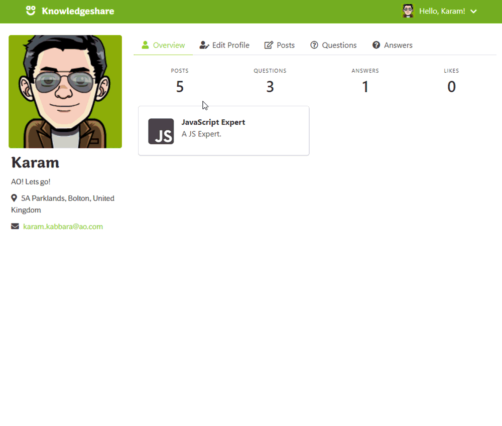
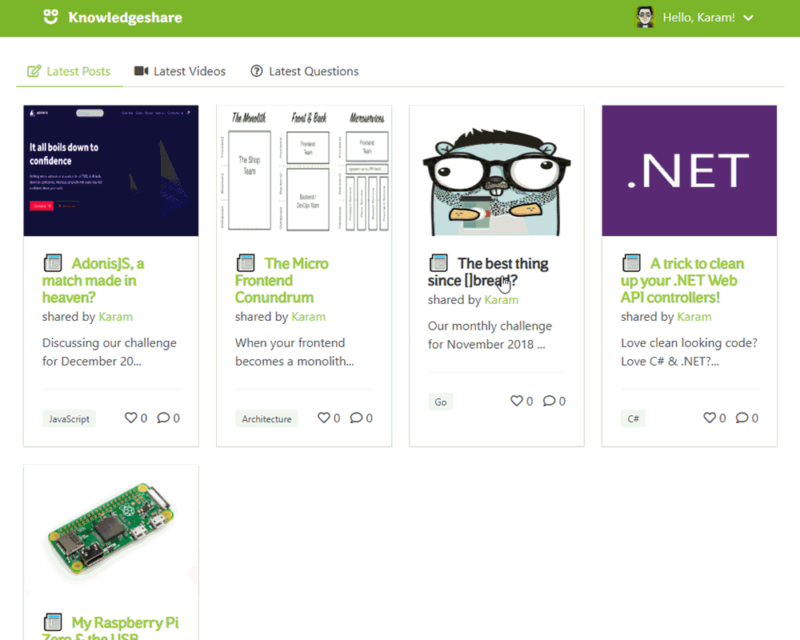
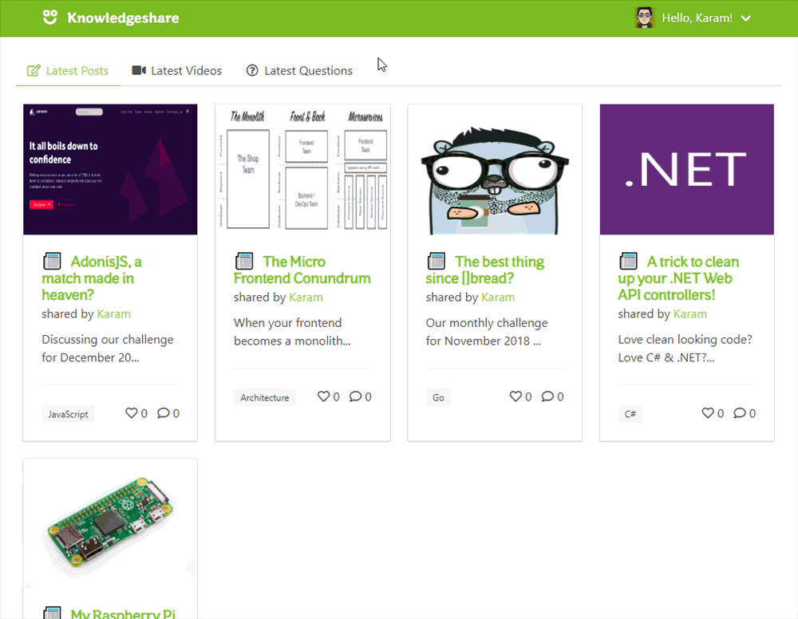

# AO Knowledgeshare Application 

A casual side project (currently an MVP being trialled and accumulating feedback) built using [AdonisJS](https://adonisjs.com/) - a Node.js based web framework - to provide a platform that not only promotes and supports knowledge sharing within our IT department at [work](https://www.ao-jobs.com/departments/it/) but also to act as an internal Stack Overflow-like platform.

# Table of Contents

* [Features](#features)
  * [User Profile Pages & Badges](#user-profile-pages)
  * [Categorised Posts & Videos](#categorised-posts)
  * [Categorised Questions](#categorised-questions)
  * [Post User Comments](#post-user-comments)
  * [Question User Answers](#question-user-answers)
  * and more...
* [Prerequisites](#prerequisites)
* [Getting Started](#getting-started)

# Features

- **[AdonisJS v4.1](https://adonisjs.com/docs/4.1/installation)**
  - Node.js based Web Framework
- **[Metascraper](https://metascraper.js.org/#/)**
  - JavaScript library to scrape web metadata
- **[Axios](https://github.com/axios/axios)**
  - Promise based HTTP client for Node.js
- **[Bulma](https://bulma.io)**
  - Flexbox based CSS/SASS Framework
- **[Webpack](https://webpack.js.org/)**
  - Transpiles SASS files

# Prerequisites:
 * [Node.js *(required)*](https://nodejs.org/) >= 8.00
 * [NPM *(required)*](https://www.npmjs.com/) >= 3.0.0
 * [Visual Studio Code](https://code.visualstudio.com/)
 * [Familiarity with Knex.js](https://knexjs.org/)

# Getting Started:
- Install the AdonisJS CLI using `npm i -g @adonisjs/cli`.
- Restore Node dependencies by running `npm install` within the project directory.
- Use `.env.example` to derive your own `.env` configuring the [database](https://adonisjs.com/docs/4.1/database) of your choice.
- `adonis migration:run` to run the application database migrations.
- `adonis seed` to *optionally* seed the database.
- `adonis serve` to run the application.
- Browse to [http://localhost:3333](http://localhost:3333).

# Features:
## User Profile Pages & Badges

## Categorised Posts & Videos

## Categorised Questions

## Post User Comments

## Question User Answers